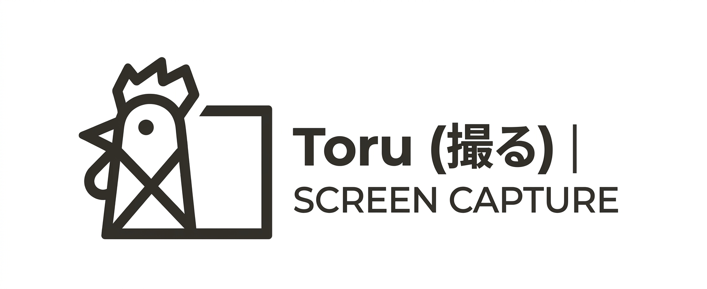

<p align="center"></p>

# Toru (撮る)

A macOS-style **screenshot & screen recording** tool for **Windows 11**.

Press <kbd>⊞</kbd> <kbd>Shift</kbd> <kbd>S</kbd> → pick a **region**, **window**, or **full screen** → annotate (or record) → **Done** auto-saves to your library.

> 撮る (*toru*) is the Japanese verb “to take a photo / shoot video.”

**Product site:** [stephenshorton.github.io/toru](https://stephenshorton.github.io/toru/)  
**Latest download:** [GitHub Releases](https://github.com/StephenSHorton/toru/releases/latest)

## Features

- **Global hotkey** capture (default Win+Shift+S; remappable)
- **Region / window / full screen** — window mode highlights on hover, click captures
- **Annotation editor** — pen, shapes, arrows, text, emoji, crop, paste-as-layer
- **Library** — Done saves automatically; choose the folder in Settings
- **Record & trim** — optional system / per-app / mic audio; Discord-friendly export
- **Freeze or live** overlay while selecting
- **Tray recents**, auto-copy, auto-update from Releases

## Download

| Asset | |
| --- | --- |
| `toru-*-windows-amd64-installer.exe` | Per-user installer (no UAC) |
| `toru-*-windows-amd64.zip` | Portable `toru.exe` |

Grab the latest from **[Releases](https://github.com/StephenSHorton/toru/releases/latest)**.

## Stack

| Layer | Choice |
| --- | --- |
| Shell | **Wails v3** + Go |
| Frontend | **React 19** + TypeScript + **shadcn/ui** + Tailwind |
| Editor | react-konva |
| Stills | DXGI (`kbinani/screenshot`) |
| Video | FFmpeg (`ddagrab` / gdigrab) |
| Package manager | **bun** |

Design notes: [`docs/PLAN.md`](docs/PLAN.md). Contributing: [`CONTRIBUTING.md`](CONTRIBUTING.md).

## Develop

### Prerequisites

- [Go](https://go.dev/dl/) (see `go.mod`)
- [Wails v3 CLI](https://v3.wails.io/): `go install github.com/wailsapp/wails/v3/cmd/wails3@v3.0.0-alpha.98`
- [Bun](https://bun.sh)
- WebView2 (ships with Windows 11)
- FFmpeg on `PATH` (or `TORU_FFMPEG`) for video
- NSIS for installer builds (`choco install nsis`)

### Quickstart

```sh
cd frontend && bun install && cd ..
wails3 dev
```

```sh
wails3 task windows:build PACKAGE_MANAGER=bun
```

## Release

```sh
git tag vX.Y.Z
git push origin vX.Y.Z
```

Tag push runs [`.github/workflows/release.yml`](.github/workflows/release.yml): builds the app + NSIS installer, publishes assets + `SHA256SUMS`. The in-app updater installs newer releases automatically.

## License

[MIT](LICENSE) © Stephen Horton and the Toru contributors.
